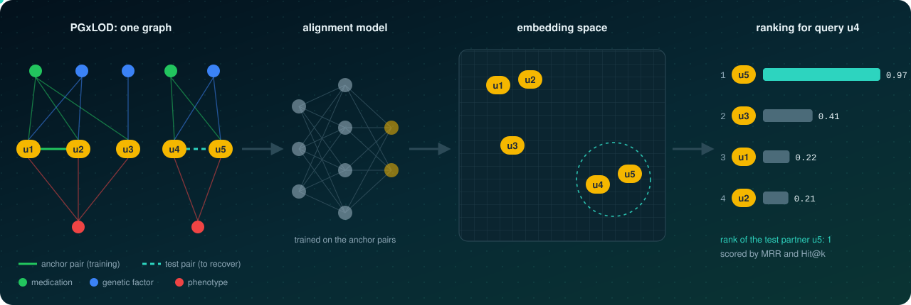

<div align="center">



<br/>


<p>
  
  
  
</p>
<p>
  
  
  
  
  
</p>

<p>
  <a href="#installation"><b>Installation</b></a> &nbsp;|&nbsp;
  <a href="#data"><b>Data</b></a> &nbsp;|&nbsp;
  <a href="#usage"><b>Usage</b></a> &nbsp;|&nbsp;
  <a href="#configuration"><b>Configuration</b></a> &nbsp;|&nbsp;
  <a href="#outputs"><b>Outputs</b></a> &nbsp;|&nbsp;
  <a href="#adding-a-model"><b>Adding a model</b></a> &nbsp;|&nbsp;
  <a href="#citation"><b>Citation</b></a>
</p>

</div>

<br/>

**EntityAlignment-PGxLOD** trains and evaluates entity alignment models on
[PGxLOD](https://doi.org/10.1186/s12859-019-2693-9), a pharmacogenomic knowledge graph. Given a
relation such as `owl:sameAs` or `skos:broadMatch`, a model learns from known pairs of
pharmacogenomic knowledge units (PGxKU) and must find the partners of unseen units among all the
units of the graph. The repository contains the eight models, the data pipeline, the evaluation
code, the configurations and the logs of every run.

<p align="center">
  
</p>

## How it works

The graph is aligned with itself: the known pairs of a relation are split into training (anchor)
pairs and test pairs; a model embeds every unit from its neighbourhood, and each test query is
ranked against all units.

<p align="center">
  
</p>

<br/>

## Installation

Requirements: Python 3.9 or later, PyTorch 2.0 or later, and a CUDA GPU for the models (the
baseline runs on CPU).

```bash
git clone https://github.com/Z-Nadjib/EntityAlignment-PGxLOD.git
cd EntityAlignment-PGxLOD
python3 -m venv .venv
.venv/bin/pip install -e code
```

The package installs its dependencies (`torch`, `numpy`, `pandas`, `matplotlib`, `tqdm`, `PyYAML`)
and an `ea-pgxlod-train` command, equivalent to `python -m src.main`.

## Data

The code reads a CSV extraction of PGxLOD. Point `Data/pgxlod_csv` to the directory that holds it:

```bash
ln -s /path/to/pgxlod_csv Data/pgxlod_csv
```

| File | Columns | Content |
|---|---|---|
| `entities_drug.csv`, `entities_genetic.csv`, `entities_phenotype.csv` | `uri, name, type` | the components and their PGxO class |
| `ucpgx_components.csv` | `ucpgx, predicate, object` | the edges linking each unit to its components |
| `ucpgx_links_unique.csv` | `a, relation, b, oriente` | the known alignments, the targets to recover |

On the first run, the graph and the splits of the six tasks are built and cached under
`Data/cache/`; later runs read the cache. The location of both
directories is set by `data.csv_dir` and `data.cache_dir` in the configuration.

<br/>

## Usage

<p align="center">
  
</p>

All commands run from `code/`.

### Train one model on one task

```bash
python -m src.main --config ../configs/rrea.yaml --regime closeMatch --device cuda:0
```

| Option | Description |
|---|---|
| `--config` | YAML configuration file (required) |
| `--regime` | alignment task, see the table below |
| `--model` | overrides `experiment.model`: `gcnalign`, `alinet`, `rrea`, `mraea`, `kecg`, `bootea`, `jape`, `naea` |
| `--device` | `cuda`, `cuda:1`, `cpu`, ... |
| `--epochs` | overrides `train.epochs` |
| `--seed` | overrides the model seed `experiment.seed` |
| `--csv-dir` | overrides `data.csv_dir` |
| `--name` | prefix of the run directory |

| `--regime` | Relation | Configuration file |
|---|---|---|
| `sameAs` | `owl:sameAs` | `configs/<model>.yaml` |
| `closeMatch` | `skos:closeMatch` | `configs/<model>.yaml` |
| `relatedMatch` | `skos:relatedMatch` | `configs/<model>.yaml` |
| `broadMatch/pgx` | `skos:broadMatch`, pharmacogenomic family | `configs/<model>_broadmatch.yaml` |
| `broadMatch/onco` | `skos:broadMatch`, oncology family | `configs/<model>_broadmatch.yaml` |
| `related` | `skos:related` | `configs/<model>_related.yaml` |

### Run the whole benchmark

```bash
python scripts/run_benchmark.py --devices cuda:0 cuda:1                  # 8 models x 6 tasks
python scripts/run_benchmark.py --tasks rrea:closeMatch kecg:related     # selected runs only
```

Runs are distributed over the given devices, one at a time per device. A run already collected
under `logs/` is skipped, so a campaign can be stopped and resumed; `--force` reruns it,
`--index-only` only rebuilds `logs/results.json`.

### Structure-only baseline

```bash
python scripts/run_baseline.py
```

A reference without learning: two units are scored by the cosine of their bags of
(predicate, component) pairs. It runs on CPU in a few minutes and writes its results next to the
models'.

### Result tables

```bash
python scripts/make_tables.py --out ../logs/tables.md      # --score cosine | csls
```

<br/>

## Models

<p align="center">
  
</p>

Each model lives in `code/src/models/<model>.py`, with its loss, and its training loop in
`code/src/trainer.py`. The encoders and losses follow the official code of each paper; the few
adaptations to PGxLOD are documented in the docstrings and in [`code/README.md`](code/README.md).
The implementations were first checked against the published DBP15K results in
[EntityAlignment-Nexus](https://github.com/Z-Nadjib/EntityAlignment-Nexus).

<br/>

## Configuration

One YAML file drives a run. Each model has three configurations, one per task family, and every
section can be overridden from the command line or edited directly.

```yaml
# excerpt of configs/rrea.yaml
experiment: {name: rrea, model: rrea, seed: 2026, device: cuda}
data:       {csv_dir: Data/pgxlod_csv, cache_dir: Data/cache}
model:      {node_hidden: 100, depth: 2, attn_heads: 1, dropout: 0.3}
train:      {epochs: 400, lr: 0.005, optimizer: rmsprop, gamma: 3.0, early_stop_patience: 10}
eval:       {every: 10, metric: csls, csls_k: 10, select: filtered, clf_tol_k: 10}
logging:    {output_dir: experiments, save_best: true}
```

| Section | Purpose |
|---|---|
| `experiment` | model name, model seed and device |
| `data` | CSV directory, cache directory, and optionally the split seed `data.seed` (2024) |
| `model` | architecture of the encoder |
| `train` | optimiser, learning rate, margins, negative sampling, early stopping |
| `eval` | validation frequency, ranking score (`cosine` or `csls`), block used to select the epoch (`filtered` or `multiref`), top-k of the decision |
| `logging` | run directory, checkpoints, CSV files and plots |

<br/>

## Outputs

Each run writes a timestamped directory under `experiments/`; `run_benchmark.py` then copies its
text artefacts under `logs/`.

```
experiments/rrea_closeMatch_20260929-052009/      logs/
|-- result.json         final test metrics        |-- closeMatch/
|-- config_used.yaml    exact configuration       |   |-- rrea/
|-- training.txt        training log              |   |   |-- result.json
|-- metrics.csv         validation curve          |   |   |-- training.txt
|-- loss.csv            loss curve                |   |   `-- ...
|-- loss_curve.png                                |   `-- baseline/
|-- ranking_metrics.png                           |-- results.json   index of all runs
|-- model_best.pt       best checkpoint           `-- resultat.md    result tables
|-- embeddings.pt
`-- embeddings_ucpgx.npy
```

`result.json` holds the selected epoch, the split statistics and, under `final`, the test metrics:

```
final.csls.filtered       MRR, Hit@1, Hit@5, Hit@10, MeanRank   one rank per test pair
final.csls.multiref       MRR, Hit@1, Hit@5, Hit@10, MeanRank   one rank per query
final.cosine.*            the same blocks with the cosine similarity
final.classification      Precision, Recall, F1, threshold      top-10 decision
```

<br/>

## Benchmark results

Mean over the six tasks of the runs stored in `logs/` (rankings with CSLS, decision with the
cosine similarity). Per-task tables: [`logs/resultat.md`](logs/resultat.md).

<p align="center">
  
</p>

<br/>

## Adding a model

1. Write the encoder and its loss in `code/src/models/<name>.py`.
2. Add a trainer to `code/src/trainer.py`, subclassing `BaseTrainer` and implementing
   `train_epoch(epoch)` and `embeddings()`; the shared loop handles validation, early stopping,
   checkpoints, curves and the final evaluation.
3. Register a builder for the model in the `builders` dictionary of `code/src/main.py`, and add
   its name to the `--model` choices.
4. Add `configs/<name>.yaml`, `configs/<name>_broadmatch.yaml` and `configs/<name>_related.yaml`,
   and the name to `MODELS` in `code/scripts/run_benchmark.py` and to `MODELS` and `NAMES` in
   `code/scripts/make_tables.py`.

<br/>

## Project structure

```
EntityAlignment-PGxLOD
|-- code
|   |-- src
|   |   |-- benchmark     graph loading, splits, metrics, scoring, baseline
|   |   |-- models        one file per model
|   |   |-- utils         configuration, logging, plotting
|   |   |-- data.py       dataset container and model-specific graph structures
|   |   |-- trainer.py    shared training loop, one trainer per model
|   |   `-- main.py       command-line entry point
|   |-- scripts           run_benchmark.py, run_baseline.py, make_tables.py
|   `-- pyproject.toml
|-- configs               24 YAML files, three per model
|-- docs/assets           figures of this page
`-- logs                  results and training logs of every run
```

<br/>

## Citation

If you use this code, please cite:

```bibtex
@misc{zahaf2026pgxlod,
  author       = {Zahaf, Nadjib},
  title        = {{EntityAlignment-PGxLOD}: Code and Configurations of the Benchmark},
  year         = {2026},
  howpublished = {\url{https://github.com/Z-Nadjib/EntityAlignment-PGxLOD}}
}
```

The benchmark is described in *Matching Pharmacogenomic Knowledge Units in PGxLOD: a Benchmark of
Entity Alignment Methods*, N. B. Zahaf, A. Coulet, J. Legrand and P. Monnin (submitted to
SWAT4HCLS).

## Acknowledgements

Experiments were run on a compute node of the Data Center for Education of CentraleSupélec Metz
and on the [Grid'5000](https://www.grid5000.fr) testbed. PGxLOD is described in
[Monnin et al., BMC Bioinformatics, 2019](https://doi.org/10.1186/s12859-019-2693-9).

## License

Released under the [MIT License](code/LICENSE).

<div align="center">
<br/>

</div>
